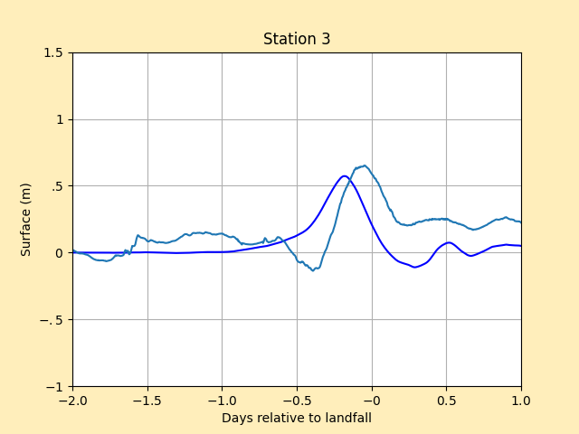
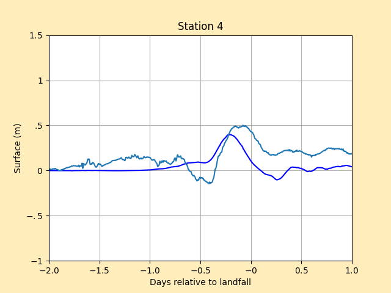

# Storm Report: Hurricane Elsa `AL052021`
This folder contains two python files (setrun.py, setplot.py) and one Makefile to simulate storm bevavior of hurricane Elsa in July 2021.

## Table of contents
- [Hurricane Elsa Information](#hurricane-elsa-information)
  * [Path & Landfall](#path--landfall)
  * [Storm surge](#storm-surge)
  * [Rainfall & Flooding](#rainfall--flooding)
- [General Code Execution Guide](#general-code-execution-guide)
- [Topography & Bathymetry Data](#topography--bathymetry-data)
- [Storm Data](#storm-data)
- [GeoClaw Parameters](#geoclaw-parameters)
  * [Landfall & Time Range](#landfall--time-range)
  * [Guages](#guages)
  * [AMRClaw](#amrclaw)
- [Observed Surge Data](#observed-surge-data)
- [Validation Result](#validation-result)
  * [Station 1-Cedar Key, FL](#station-1-cedar-key-fl)
  * [Station 2-Clearwater Beach, FL](#station-2-clearwater-beach-fl)
  * [Station 3-Old Port Tampa, FL](#station-3-old-port-tampa-fl)
  * [Station 4-Port Manatee, FL](#station-4-port-manatee-fl)
  * [Station 5-Naples, FL](#station-5-naples-fl)
  * [Station 6-Key West, FL](#station-6-key-west-fl)
  * [Result Interpretation](#result-interpretation)
- [Conclusion](#conclusion)

## Hurricane Elsa Information
### Path & Landfall
Elsa was a category 1 hurricane formed over the central tropical Atlantic. Elsa affected many countries including Barbados, St. Lucia, St. Vincent and the Grenadines, Martinique, the Dominican Republic, Haiti, Cuba, and the United States. It caused around $1 billion in total damage and was responsible for 13 direct fatalities. Elsa affected the Florida Keys and the west coast of Florida along its path before making landfall in the Big Bend region on 6th and 7th July. After the Florida landfall, Elsa turned toward the northeast and accelerated towards the U.S. eastern seaboard. 
### Storm surge
Elsa produced storm surge inundation levels of 1 ft to 3 ft above normally dry ground (AGL) along portions of the west coast of Florida, with the highest water levels occurring along the coasts of Hernando, Citrus, Levy, Dixie, and Taylor Counties at around 2 ft to 3 ft. 
### Rainfall & Flooding
Elsa produced a series of heavy rainfalls along its path involing the eastern US. In west Florida, a large region encountered a 3–7 inches of rain fell. Several monitoring sites across southwest Florida recorded rainfall amount of 8–11 inches. Rainfall amounts of 3–7 inches were observed in the Lower Florida Keys, with the highest accumulation occurring in Key West. Significant flooding occurred in multiple areas of Key West as a heavy rainband set up over the island.

*Reference: National Hurricane Center Tropical Cyclone Report*
(https://www.nhc.noaa.gov/data/tcr/AL052021_Elsa.pdf)

## General Code Execution Guide
If running this example, download setrun.py, setplot.py, and Makefile to the appropriate directory. Execute `$ make all` or `$ make .plots` to compile the code, run the simulation, and plot the results. If problems will be encountered, please refer to <a href="http://www.clawpack.org/quick_surge.html?highlight=storm%20surge" target="_blank">Storm Surge Guide</a> for possible solutions. 

## Topography & Bathymetry Data
Topography data was obtained from:
https://www.gebco.net/data_and_products/gridded_bathymetry_data/

It can be fetched in setrun.py by modifying codes in topography section similar to this:
```python
# Fetch topo data
clawutil.data.get_remote_file(
           "http://www.columbia.edu/~ktm2132/bathy/gulf_caribbean.tt3.tar.bz2")
```

## Storm Data
Storm specific data for Hurricane Elsa was retrieved from NOAA’s storm data archive:
http://ftp.nhc.noaa.gov/atcf/archive/2021/bal052021.dat.gz

In setrun.py, data can be directly fetched by modifying codes in storm data section similar to this:
```python
# Convert ATCF data to GeoClaw format
clawutil.data.get_remote_file(“http://ftp.nhc.noaa.gov/atcf/archive/2021/bal052021.dat.gz”)
atcf_path = os.path.join(data_dir, “bal052021.dat”)
```

## GeoClaw Parameters
### Landfall & Time Range
Time of landfall was set in the simulation to be 7 August, 1400 UTC. Time range of simulation was set to be 2 days (48 hours) before landfall and 1 day (24 hours) after landfall.
### Guages
Gauges were selected in the NOAA Inundations dashboard:
https://tidesandcurrents.noaa.gov/map/index.html
### AMRClaw
AMRClaw is a very powerful algorithm to refine areas for analysis. After merging the algorithm in setrun.py, we will be able to have a high resolution of regions which will effectively solve bad simulation curves by GeoClaw due to wrongly appeared dry cells from low resolution. One can include or exclude AMRClaw algorithm by modifying codes in setrun.py similar to
```python
from clawpack.clawutil import clawdata
rundata = clawdata.ClawRunData(claw_pkg, num_dim)
```
One may also want to modify AMR parameters like `amr_levels_max` and `refinement_ratios` in a more customized way. In this example, `amr_levels_max` was set to be `7` and `refinement_ratios` was set to be `[2, 2, 2, 3, 4, 4, 4]`. More information regarding parameter can be found in the documentation here: <a href="https://www.clawpack.org/setrun_amrclaw.html#setrun-amrclaw" target="_blank">AMRClaw Information</a>.

## Observed Surge Data
To compare simulation surge data by GeoClaw, we introduced the observed surge data using `clawpack.geoclaw.util.fetch_noaa_tide_data` along with each guage's station ID. When plotting the observed surge data, we explicitly deduct the tide amount from sea level at each location to make the data solely representing storm surge.

## Validation Result
### Station 1-Cedar Key, FL
Cedar Key, FL `ID: 8727520` experienced a storm surge of approximately 0.75 meter. GeoClaw predicted approximately 0.80 meters. 


### Station 2-Clearwater Beach, FL
Clearwater Beach, FL `ID: 8726724` experienced a storm surge of approximately 0.50 meter. GeoClaw predicted approximately 0.25 meters. 


### Station 3-Old Port Tampa, FL
Old Port Tampa, FL `ID: 8726607` experienced a storm surge of approximately 0.65 meter. GeoClaw predicted approximately 0.55 meters. 


### Station 4-Port Manatee, FL
Port Manatee, FL `ID: 8726384` experienced a storm surge of approximately 0.50 meter. GeoClaw predicted approximately 0.40 meters. 


### Station 5-Naples, FL
Naples, FL `ID: 8725110` experienced a storm surge of approximately 0.60 meter. GeoClaw predicted approximately 0.20 meters. 


### Station 6-Key West, FL
Key West, FL `ID: 8724580` experienced a storm surge of approximately 0.30 meter. GeoClaw predicted approximately 0.08 meters. 


### Result Interpretation
Differences in surface level are reasonable and acceptable with maximum error among all guages less than 0.5 meters. Individual difference are correlated to rainfall and flooding amount which was not included in the GeoClaw simulation due to their complexity and unpredictability. However, notice there's also a discrepancy of timing between major surge at Key West station. The reason is Key West experienced the most intense rainfall and flooding which explains the surge on observed data. Note that there's little or no precipitation at hurricane eye which explains the surface drop for observed data but a surge on simulation data.

## Conclusion
Timing and pattern of storm surges obtained from GeoClaw were generally consistent with the observed data. In most cases, the observed storm surge slightly exceeded the amount of which from GeoClaw simulation. The reason may likely correspond to the rainfall and flooding caused by hurricane Elsa which was not taken into account by GeoClaw simulation. Future studies can investigate the relationship between timing of surges on real data and precipitation, so that a more detailed analysis can be conducted. 


Author: Jinpai (Max) Zhao
```
jz3445@columbia.edu
```
